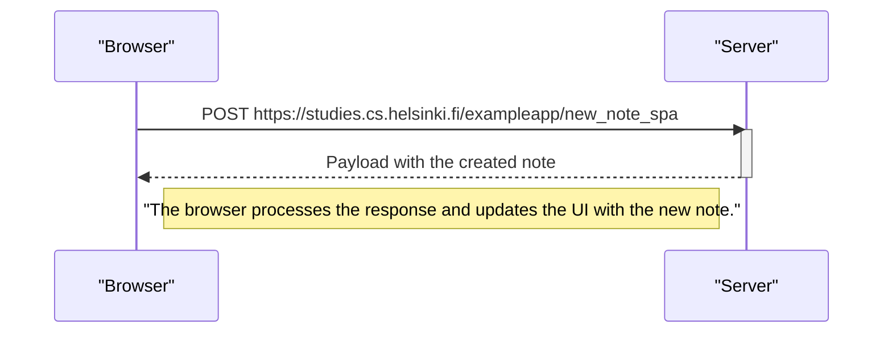

```mermaid
sequenceDiagram
    participant browser as "Browser"
    participant server as "Server"

    browser->>server: POST https://studies.cs.helsinki.fi/exampleapp/new_note_spa
    activate server
    server-->>browser: Payload with the created note
    deactivate server

    Note right of browser: "The browser processes the response and updates the UI with the new note."

```
